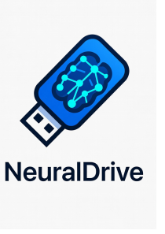

<p align="center">
  
</p>

<h3 align="center">Boot a USB stick. Get an LLM server.</h3>

<p align="center">
  NeuralDrive is a purpose-built Linux distribution that turns any x86_64 machine into a<br>
  GPU-accelerated inference server in under two minutes. No install. No Docker. No config files.<br>
  Just boot and go.
</p>

<p align="center">
  <a href="https://rightbracket.github.io/NeuralDrive/user-guide/">User Guide</a> &middot;
  <a href="https://rightbracket.github.io/NeuralDrive/dev-guide/">Developer Guide</a> &middot;
  <a href="https://rightbracket.github.io/NeuralDrive/user-guide/getting-started/quick-start.html">Quick Start</a> &middot;
  <a href="https://rightbracket.github.io/NeuralDrive/user-guide/api/coding-agents.html">Connect a Coding Agent</a>
</p>

---

## Why

Running LLMs locally still means wrangling CUDA drivers, configuring Ollama, setting up reverse proxies, managing firewall rules, and hoping nothing breaks on reboot. NeuralDrive eliminates all of that.

Flash an ISO to a USB drive. Boot from it. Your GPU is auto-detected, drivers are loaded, TLS certificates are generated, and an OpenAI-compatible API is live on the network — all before you've finished your coffee.

When you're done, pull the USB stick out. The host machine is untouched.

## How it works

```
┌──────────────────────────────────────────────────────────────────┐
│                       BOOT MEDIA (USB/CD)                        │
├──────────┬─────────────┬─────────────────┬───────────────────────┤
│ EFI      │ Boot        │ System          │ Persistent Data       │
│ FAT32    │ (GRUB)      │ (SquashFS)      │ models, config, logs  │
│ 512 MB   │ 1 GB        │ ~4-8 GB         │ expandable            │
└──────────┴─────────────┴─────────────────┴───────────────────────┘

┌──────────────────────────────────────────────────────────────────┐
│  Caddy Reverse Proxy        :443 Web UI  /  :8443 API Gateway    │
├──────────────┬──────────────┬────────────────┬───────────────────┤
│  Ollama      │  Open WebUI  │  System API    │  GPU Hot          │
│  LLM Engine  │  Dashboard   │  Management    │  Monitoring       │
│  :11434      │  :3000       │  :3001         │  :1312            │
├──────────────┴──────────────┴────────────────┴───────────────────┤
│  GPU Auto-Detection                                              │
│  NVIDIA (CUDA 12.x) · AMD (ROCm 6.x) · Intel Arc · CPU fallback. │
├──────────────────────────────────────────────────────────────────┤
│  Debian 12 (bookworm)  ·  Linux 6.1 LTS  ·  Read-only rootfs     │
└──────────────────────────────────────────────────────────────────┘
```

The root filesystem is immutable (SquashFS). Downloaded models, user accounts, and configuration live on a separate persistence partition that survives reboots. The system always boots into a known-good state.

## Features

**Inference**
- OpenAI-compatible API (`/v1/chat/completions`, `/v1/models`, `/v1/embeddings`) — works with Cursor, Continue, Copilot, Aider, and any OpenAI SDK
- Native Ollama API for model management (`pull`, `show`, `delete`, `copy`)
- Multi-model concurrency with automatic VRAM management and LRU eviction
- CPU fallback with AVX2/AVX-512 optimization when no GPU is available

**Hardware**
- Automatic GPU detection via PCI enumeration at boot — zero manual driver setup
- NVIDIA (Pascal through Hopper), AMD (RDNA 2/3, CDNA), Intel Arc
- Multi-GPU support within the same vendor family
- Safe Mode boot option bypasses GPU drivers entirely for troubleshooting

**Security**
- Self-signed TLS on all traffic from first boot (auto-generated CA + server certs)
- Bearer token authentication on all API endpoints
- nftables firewall with default-deny policy
- SSH disabled by default, key-only auth when enabled
- Dedicated service users with systemd hardening (PrivateDevices, ProtectSystem, NoNewPrivileges)
- Optional LUKS2 encryption on the persistence partition

**Management**
- **Web Dashboard** (Open WebUI) — chat, RAG, model management, multi-user accounts
- **Terminal UI** — Textual-based TUI on the local console for monitoring, model management, service control, and a lightweight chat interface
- **System API** — FastAPI backend for programmatic management of services, networking, storage, and GPU status
- **First-boot wizard** — guided setup for credentials, networking, persistence, and initial model selection

## Quick start

```bash
# 1. Flash the ISO to a USB drive

# Linux:
sudo ./scripts/neuraldrive-flash.sh neuraldrive.iso /dev/sdX

# macOS:
diskutil unmountDisk /dev/diskN
sudo dd if=neuraldrive.iso of=/dev/rdiskN bs=4m status=progress

# Windows / any platform: use Balena Etcher (https://etcher.balena.io/)
```

See the [Writing the USB Drive](https://rightbracket.github.io/NeuralDrive/user-guide/getting-started/writing-usb.html) guide for full platform-specific instructions and persistence partition setup.

```bash
# 2. Boot the target machine from USB

# 3. Complete the first-boot wizard on the console

# 4. From any machine on the network:
curl -k https://neuraldrive.local:8443/v1/chat/completions \
  -H "Authorization: Bearer <YOUR_API_KEY>" \
  -H "Content-Type: application/json" \
  -d '{
    "model": "llama3.1:8b",
    "messages": [{"role": "user", "content": "Hello from NeuralDrive"}]
  }'
```

The API key is generated during the first-boot wizard and stored in `/etc/neuraldrive/api.key`.

## Hardware requirements

| | Minimum | Recommended |
|---|---|---|
| **CPU** | x86_64 with AVX2 | x86_64 with AVX-512 |
| **RAM** | 8 GB | 32–64 GB |
| **GPU** | Optional (6 GB VRAM) | 24 GB+ VRAM |
| **Storage** | 16 GB USB 3.0 | 128 GB+ SSD |

**What fits where:**

| VRAM | Models |
|---|---|
| No GPU | 3B on CPU (slow but works) |
| 6 GB | `phi3:mini`, `qwen2.5:3b` |
| 8 GB | `llama3.1:8b` |
| 12 GB | `codestral:latest` |
| 24 GB+ | `llama3.1:70b` (Q4) |

## Local TUI

The terminal interface launches automatically on the console. No network required.

```
┌────────────────── NeuralDrive v1.0.0 ────────────────────────────┐
│ Host: neuraldrive.local   │ Uptime: 2h 15m  │ IP: 192.168.1.50   │
├──────────────────────────────────────────────────────────────────┤
│ GPU: NVIDIA RTX 4090 │ VRAM: 12.4/24.0 GB │ Temp: 65°C │  85%    │
│ CPU: 12%             │ RAM: 18.2/64.0 GB  │ Disk: 45.2 GB        │
├──────────────────────────────────────────────────────────────────┤
│ LOADED MODELS                                                    │
│ ● llama3.1:8b        [GPU] 4.7 GB   85 req/min                   │
│ ● codestral:latest   [GPU] 8.2 GB   12 req/min                   │
│ ○ phi3:mini           ---  (not loaded)                          │
├──────────────────────────────────────────────────────────────────┤
│ [M]odels  [S]ervices  [N]etwork  [L]ogs  [C]hat  [Q]uit          │
└──────────────────────────────────────────────────────────────────┘
```

## Building from source

NeuralDrive images are built using Debian's `live-build` toolchain inside a Docker container.

```bash
# Clone and build
git clone https://github.com/Rightbracket/NeuralDrive.git
cd NeuralDrive
docker compose run --rm builder

# The ISO will be in ./output/
```

Or natively on a Debian 12 host:

```bash
sudo apt install live-build debootstrap squashfs-tools xorriso grub-pc-bin grub-efi-amd64-bin
sudo ./build.sh
```

See the [Developer Guide](docs/dev-guide/src/SUMMARY.md) for the full build system reference, architecture docs, and contribution guidelines.

## Project structure

```
NeuralDrive/
├── config/
│   ├── hooks/live/              # Build-time chroot scripts
│   ├── includes.chroot/         # Files copied to the root filesystem
│   │   ├── etc/neuraldrive/     # Config files (Caddyfile, ollama.conf, etc.)
│   │   ├── etc/systemd/system/  # 11 systemd service units
│   │   └── usr/lib/neuraldrive/ # TUI, System API, GPU detection, certs
│   ├── package-lists/           # APT package selections
│   └── archives/                # Third-party repo keys
├── scripts/                     # Flash, model download, build utilities
├── tests/                       # Boot, GPU, and API test suites
├── docs/
│   ├── user-guide/              # 52-chapter mdbook (getting started → reference)
│   └── dev-guide/               # 38-chapter mdbook (architecture → release)
└── plan/                        # Internal design documents
```

## Documentation

The full documentation is organized into two mdbook volumes, each with its own navigation and search and published to GitHub Pages:

**[User Guide](docs/user-guide/src/SUMMARY.md)** — Getting started, model management, API integration, administration, advanced configuration, troubleshooting, and reference material. Written for three audiences: home lab hobbyists, developers connecting coding agents, and IT administrators.

**[Developer Guide](docs/dev-guide/src/SUMMARY.md)** — Architecture, build system, component internals (GPU detection, TUI, System API, Caddy, certificates), testing strategy, and release process.

## Contributing

Contributions are welcome. See [How to Contribute](docs/dev-guide/src/contributing/how-to-contribute.md) for details.

1. Fork the repository
2. Create a feature branch
3. Follow the [code style guidelines](docs/dev-guide/src/contributing/code-style.md)
4. Submit a pull request

## License

[MIT](LICENSE)
